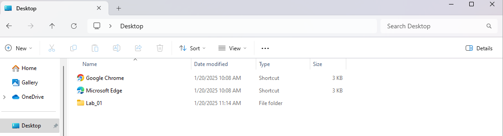
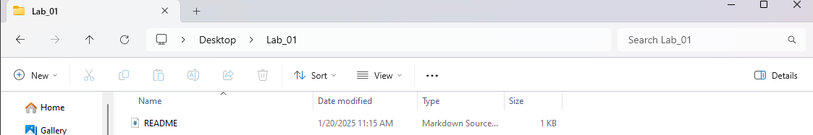
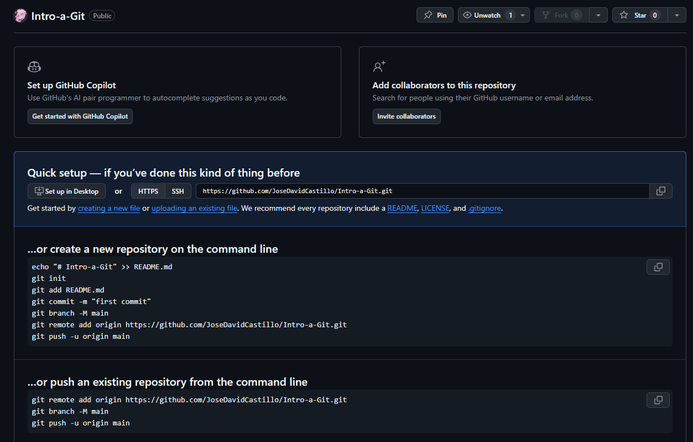
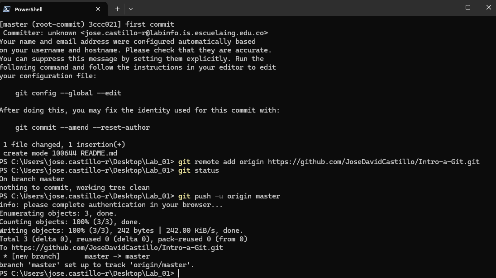
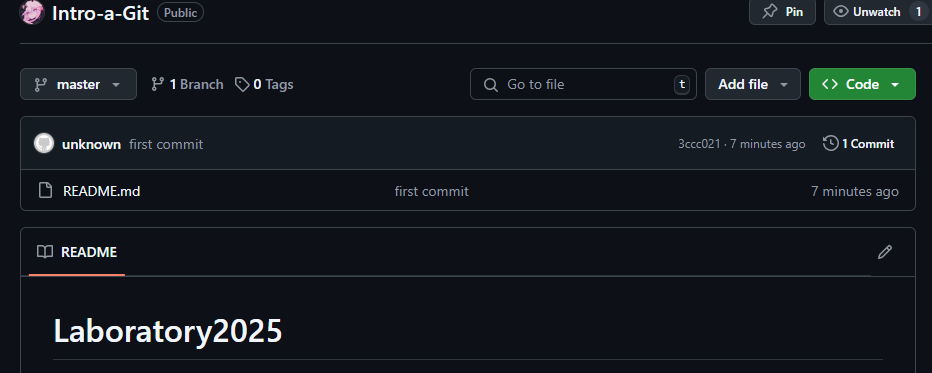
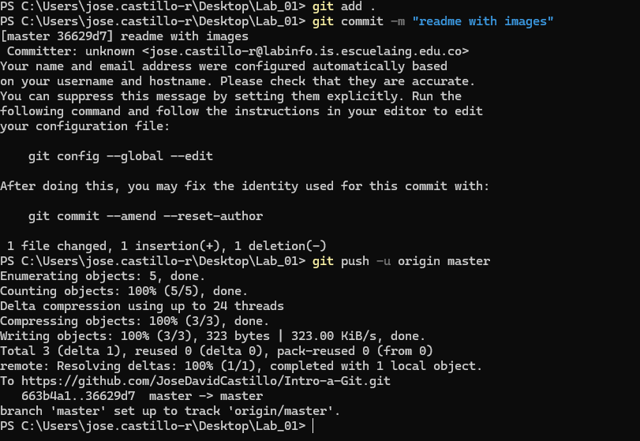

# Laboratory2025
## Jose David Castillo Rodriguez

PARTE I (Trabajo Individual).
Crea un repositorio localmente.

Agrega un archivo de ejemplo al repositorio, el README.md puede ser una gran opción.

Averigua para qué sirve y como se usan estos comandos git add y git commit -m “mensaje”

El commando git add se utiliza para añadir cambios realizados a los archivos locales, es decir hace un tipo de marca sobre estos para que sean incluidos en el proximo commit. Por otro lado el commando de git commit -m "mensaje" se utiliza para confirmer los cambios en el repositorio local (que han sido marcados con el git add) seguidos de un comentario en el cual se sueole mencionar que hace esta modificacion.

Configura el repositorio local con el repositorio remoto.

Vuelve a subir los cambios y observa que todo esté bien en el repositorio remoto (en GitHub).

CAMBIOS12